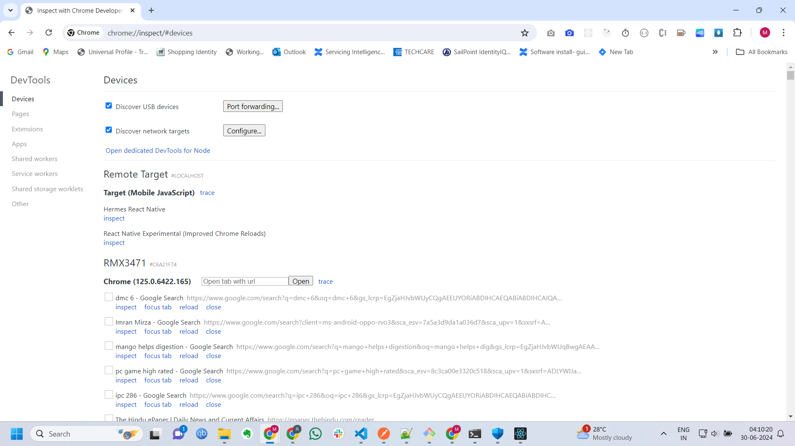
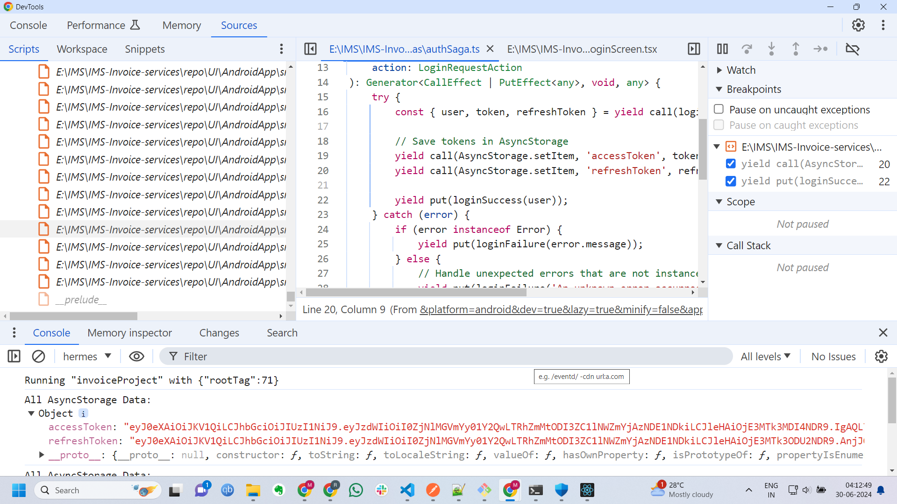

This is a new [**React Native**](https://reactnative.dev) project, bootstrapped using [`@react-native-community/cli`](https://github.com/react-native-community/cli).

# Getting Started

>**Note**: Make sure you have completed the [React Native - Environment Setup](https://reactnative.dev/docs/environment-setup) instructions till "Creating a new application" step, before proceeding.

## Step 1: Start the Metro Server

First, you will need to start **Metro**, the JavaScript _bundler_ that ships _with_ React Native.

To start Metro, run the following command from the _root_ of your React Native project:

```bash
# using npm
npm start

# OR using Yarn
yarn start
```

## Step 2: Start your Application

Let Metro Bundler run in its _own_ terminal. Open a _new_ terminal from the _root_ of your React Native project. Run the following command to start your _Android_ or _iOS_ app:

### For Android

```bash
# connecting the React Native development server on your machine to the Android device/emulator. (OPTIONAL) 
adb reverse tcp:8081 tcp:8081

# check device 
adb devices

# run on adroid device 
npx react-native run-android --deviceId=DEVICE_ID

# using npm
# npm run android

# OR using Yarn
# yarn android
```

### For iOS

```bash
# using npm
npm run ios

# OR using Yarn
yarn ios
```

If everything is set up _correctly_, you should see your new app running in your _Android Emulator_ or _iOS Simulator_ shortly provided you have set up your emulator/simulator correctly.

This is one way to run your app — you can also run it directly from within Android Studio and Xcode respectively.

## Step 3: Modifying your App

Now that you have successfully run the app, let's modify it.

1. Open `App.tsx` in your text editor of choice and edit some lines.
2. For **Android**: Press the <kbd>R</kbd> key twice or select **"Reload"** from the **Developer Menu** (<kbd>Ctrl</kbd> + <kbd>M</kbd> (on Window and Linux) or <kbd>Cmd ⌘</kbd> + <kbd>M</kbd> (on macOS)) to see your changes!

   For **iOS**: Hit <kbd>Cmd ⌘</kbd> + <kbd>R</kbd> in your iOS Simulator to reload the app and see your changes!

## Congratulations! :tada:

You've successfully run and modified your React Native App. :partying_face:

### Now what?

- If you want to add this new React Native code to an existing application, check out the [Integration guide](https://reactnative.dev/docs/integration-with-existing-apps).
- If you're curious to learn more about React Native, check out the [Introduction to React Native](https://reactnative.dev/docs/getting-started).

# Troubleshooting

If you can't get this to work, see the [Troubleshooting](https://reactnative.dev/docs/troubleshooting) page.

# Learn More

To learn more about React Native, take a look at the following resources:

- [React Native Website](https://reactnative.dev) - learn more about React Native.
- [Getting Started](https://reactnative.dev/docs/environment-setup) - an **overview** of React Native and how setup your environment.
- [Learn the Basics](https://reactnative.dev/docs/getting-started) - a **guided tour** of the React Native **basics**.
- [Blog](https://reactnative.dev/blog) - read the latest official React Native **Blog** posts.
- [`@facebook/react-native`](https://github.com/facebook/react-native) - the Open Source; GitHub **repository** for React Native.

# Folder Strucuture 
```
my-invoice-app/
├── android/                   # Native Android files
├── ios/                       # Native iOS files
├── node_modules/              # Node.js modules
├── src/                       # Source files
│   ├── assets/                # Images, fonts, etc.
│   ├── components/            # Reusable components
│   │   ├── Button.tsx
│   │   └── ...
│   ├── navigation/            # Navigation configuration
│   │   ├── AppNavigator.tsx
│   │   └── ...
│   ├── screens/               # Screen components
│   │   ├── LoginScreen.tsx
│   │   ├── RegisterScreen.tsx
│   │   ├── MainScreen.tsx
│   │   ├── UserScreen.tsx
│   │   ├── ShopScreen.tsx
│   │   ├── InvoiceScreen.tsx
│   │   └── ...
│   ├── services/              # API calls and business logic
│   │   ├── api.ts             # API configuration and utility functions
│   │   ├── authService.ts     # Auth related API calls
│   │   ├── userService.ts     # User related API calls
│   │   ├── shopService.ts     # Shop related API calls
│   │   ├── invoiceService.ts  # Invoice related API calls
│   │   └── ...
│   ├── store/                 # State management (Redux, Redux Saga)
│   │   ├── actions/           # Redux actions
│   │   │   ├── authActions.ts
│   │   │   ├── userActions.ts
│   │   │   ├── shopActions.ts
│   │   │   ├── invoiceActions.ts
│   │   │   └── ...
│   │   ├── reducers/          # Redux reducers
│   │   │   ├── authReducer.ts
│   │   │   ├── userReducer.ts
│   │   │   ├── shopReducer.ts
│   │   │   ├── invoiceReducer.ts
│   │   │   └── ...
│   │   ├── sagas/             # Redux sagas
│   │   │   ├── authSaga.ts
│   │   │   ├── userSaga.ts
│   │   │   ├── shopSaga.ts
│   │   │   ├── invoiceSaga.ts
│   │   │   ├── index.ts
│   │   │   └── ...
│   │   ├── store.ts           # Redux store configuration
│   │   └── types.ts           # Type definitions for Redux state and actions
│   ├── utils/                 # Utility functions and helpers
│   │   ├── validation.ts
│   │   └── ...
│   ├── App.tsx                # Entry point of the app
|── index.js                   # Entry point for React Native
├── .gitignore                 # Git ignore file
├── app.json                   # Application configuration
├── babel.config.js            # Babel configuration
├── metro.config.js            # Metro bundler configuration
├── package.json               # NPM package configuration
├── tsconfig.json              # TypeScript configuration
└── README.md                  # Project readme
```
###Debug guide with Hermes / Experimental debugger 
- Followup with https://reactnative.dev/docs/debugging?js-debugger=hermes
  - In a Chrome browser window, navigate to chrome://inspect.
  - Use the "Configure..." button to add the dev server address (typically localhost:8081).
  - You should now see a "React Native Experimental (Improved Chrome Reloads)" and "Hermes React Native" targets with "inspect" links. Click the link below React Native Experimental (Improved Chrome Reloads)
  to open the debugger.
  
  
- Source scripts will get loaded/updated everytime you refresh the metro manually on change of code. Live reload not supported yet. 


